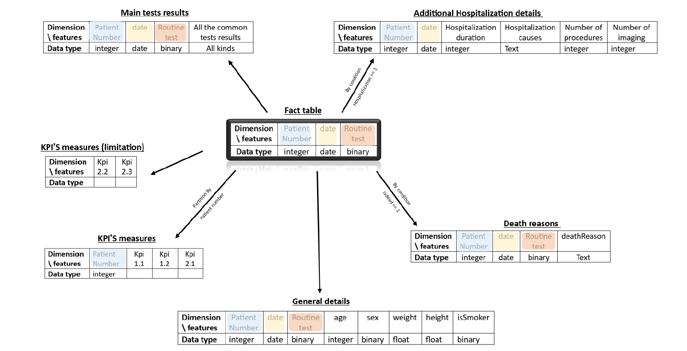
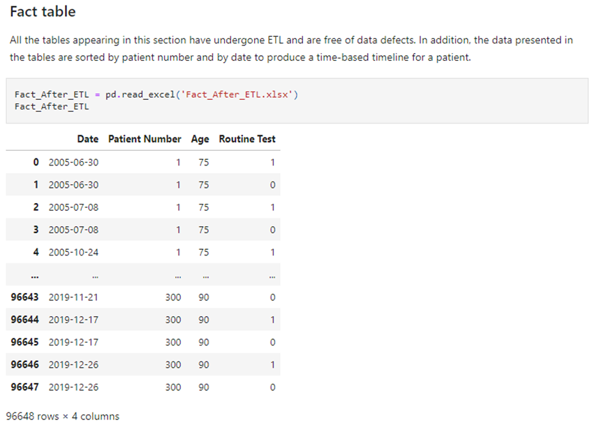
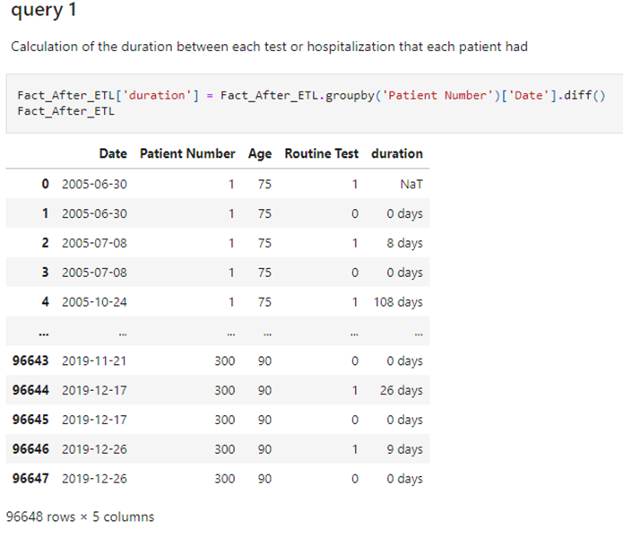
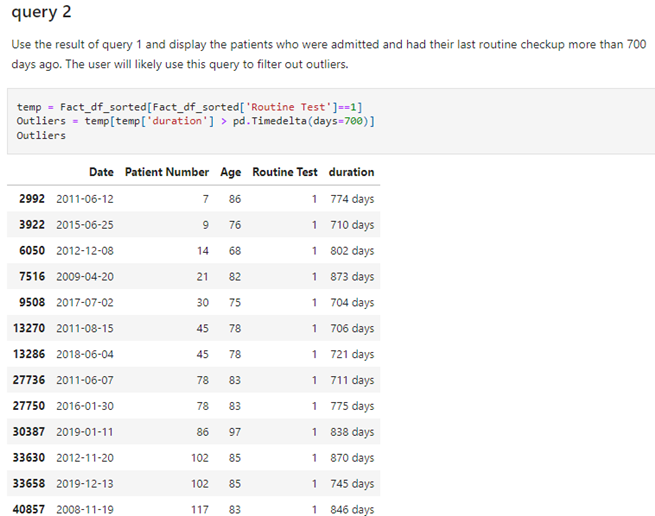
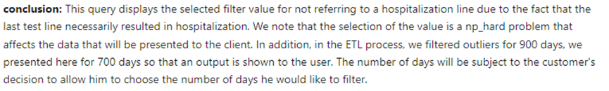
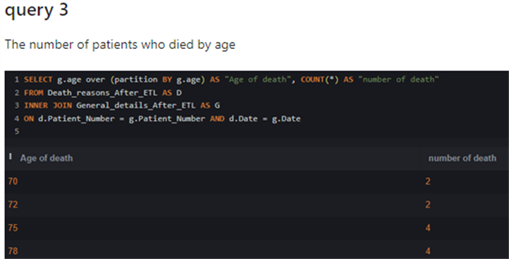
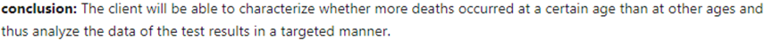
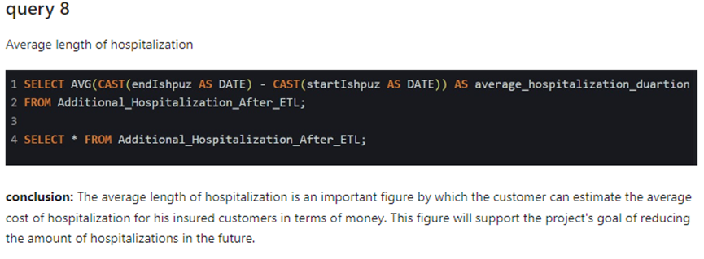

# BI-Project
As part of my final project in industrial engineering and management, we are trying to predict hospitalization or death without a clear reason for the elderly population in Israel. For this purpose, we use systematic data that we increased based on real data of 300 patients provided by one of the health funds in Israel.
Our goal in this project is to provide quality information and identify meaningful features from the data to give medical professionals valuable insights. Specifically, the business insight is to find the characteristic that most influence hospitalization or planned cardiac death among the elderly population in Israel.
For more information about the project objective and our KPIs, see the file titled "Project Objective".
After analyzing the data warehouse, we determined that a star schema would be the most efficient schema for our needs. This choice was based on the fact that our data has no hierarchical structure and is quite extensive. With the help of this scheme, we can classify and organize the information in a simple and efficient way.

Next, we performed a custom ETL process for each table in the data warehouse. You can find all the processes in the ETL folder in this project.

In addition, we performed an STTM process on a selected part of the original data. Can be found it in the STTM folder in this project.

In the end, we loaded all the tables after the ETL process and tried to get business insights from them using SQL and Window Function queries.
Here are some interesting queries we did:

Finally, due to the fact that the data is engineered and not real, there are many gaps and duplicates that affect the displayed query outputs. For this reason and because the output obtained is partial and not reflective, we did not see fit to draw general conclusions. However, at the end of each query, state what insights and conclusions the client can draw from performing them.
We do think that when the customer enters the real data, he will be able to get a lot of important insights, for example, following query number 8, the customer can focus on the age group in which the most tests were performed and try to characterize and analyze the data and test results for the age population with the highest risk of hospitalization.

# Note:
Chronological order for reading the project:
1. The project's primary purpose are in the file: "Business intelligence project instructions 2023.pdf"
2. The purpose of the project and the definition of the indicators is in the file: "The Project Goal .pdf"
3. The data warehouse definition is in the file: "Data Warehouse definition.pdf"
4. The ETL process implementation is in the ETL folder
5. The STTM process application is in the STTM folder.
6. Analysis of the data warehouse by queries and conclusions is in the Querys folder